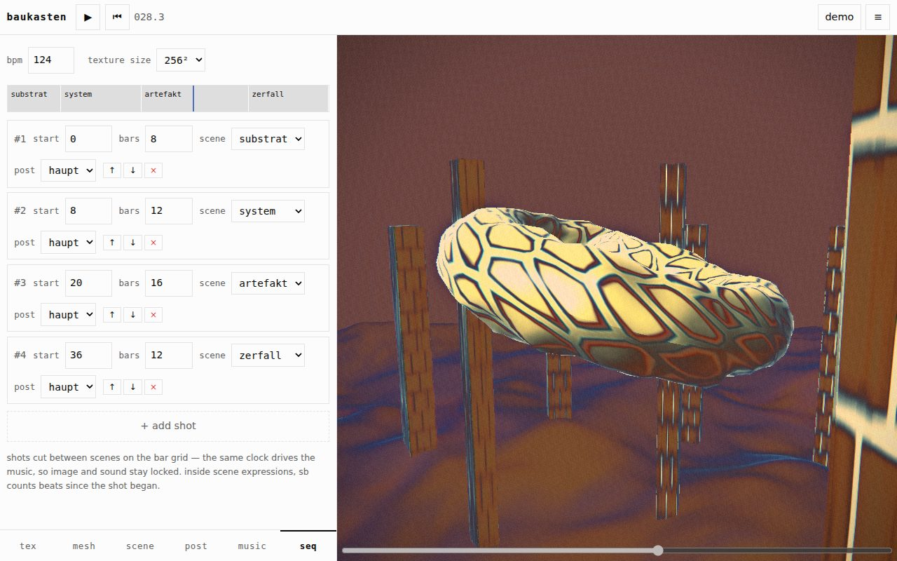

# baukasten

A tiny, mobile-first demoscene tool in the spirit of farbrausch's
[werkkzeug](https://github.com/farbrausch/fr_public) — and an experiment in
**AI as tool-writer instead of AI as final result**.

Live: [research.enigmeta.com/baukasten](https://research.enigmeta.com/baukasten/)

## The experiment

Mainstream creative AI operates at the *artefact level*: it generates finished
outputs, and the practitioner's role shrinks to prompting and selecting. This
project tests the opposite position — AI at the *system level*: the AI (Claude)
wrote the instrument, and every image and sound the instrument produces is
authored by whoever plays it, out of fully inspectable, deterministic ops.

The default piece, **ARTEFAKT**, is the demonstration: the tool is the system,
the demo is the artefact, and the distinction is the point.

## What it does

Everything is an **op stack** (werkkzeug's model, minus the wires — multi-input
ops reference other stacks by name, which works with thumbs on a phone):

- **tex** — procedural textures: value/fbm/ridged noise, shapes, cells,
  voronoi, bricks; colorize (iq cosine palettes), transform, distort, blur,
  blend. Evaluated in WASM, seamlessly tileable, fully deterministic.
- **mesh** — primitives (cube, sphere, cylinder, torus, grid) plus displace,
  twist, array (linear/radial), merge.
- **scene** — env + light + camera + objects. Every parameter accepts a
  number *or an expression* over `t, b, bar, bt, sb, kick, snare, hat` —
  the audio patterns feed decaying envelopes into the visuals.
- **post** — bloom, palette grade, LUT (from any texture stack), vignette,
  grain, chromatic aberration, fade.
- **music** — a synthesized 6-voice band (kick / snare / hat / bass / arp /
  pad), 16-step patterns arranged bar-by-bar into a song. WebAudio, no samples.
- **seq** — shots cut between scenes on the bar grid. The AudioContext clock
  is the master clock, so image and sound cannot drift.

## Engine

The procedural core (textures + meshes) is ~900 lines of Zig compiled to a
40 KB `engine.wasm` (freestanding, no allocator — a bump arena over raw wasm
memory, demoscene style). The JS side is plain ES modules: WebGL2 renderer,
WebAudio synth, no build step, no dependencies.

> The brief asked for Rust. This environment's egress policy blocks
> static.rust-lang.org and crates.io downloads, so the wasm32 stdlib was
> unreachable; Zig (via the `ziglang` pip package) provided the same
> systems-language-to-WASM path with a fully offline toolchain. The engine is
> plain command-buffer interpretation over linear memory — it would port to
> Rust almost mechanically.

Rebuild with `zig/build.sh` (requires `pip install ziglang`); the compiled
`engine.wasm` is committed so the site stays a static, no-build deploy.

## ARTEFAKT — the default demo

48 bars at 124 BPM, four acts on one timeline:

1. **SUBSTRAT** — raw matter. A ridged-fbm terrain in a deep-blue void;
   heartbeat kick, root drone.
2. **SYSTEM** — order. A double ring of displaced megaliths; bass, hats and
   the arp enter as the camera weaves the ring.
3. **ARTEFAKT** — the relic. A twisted, noise-displaced torus with a burning
   core, hovering over the field. Its emissive glow is the kick envelope;
   the aberration flick is the snare. Full band.
4. **ZERFALL** — dissolution. The camera lets go, grain rises, the band strips
   back to a drone, fade to black.

One palette family (iq cosine: `a + b·cos(2π(c·t+d))`) carries the whole
piece: *abyss* for the world, *ember* for the artefact and the grade.

Tap **demo** for the full-screen synced run. Then open any page and bend it —
it's your instrument now.
